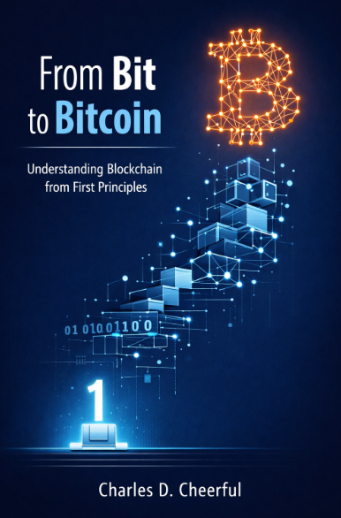

### From Bit to Bitcoin

Understanding Bitcoin and blockchain from first principles. Starting with electricity and bits, through cryptography and networks, to consensus mechanisms and cryptocurrency. No technical knowledge required - just curiosity.
