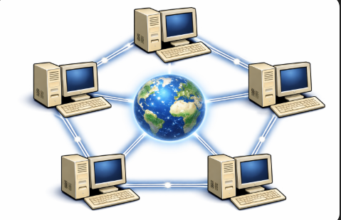

# Chapter 5: The Trust Problem

*The internet is public by default. More open than your ex's legs.*

---

We've established that computers communicate using protocols—agreed-upon rules that enable coordination across the globe. The Internet works because billions of devices follow the same rules to send packets of data to each other.

But here's the problem: **The Internet is a public network.**

If you visualize the computers connected to each other with lines, it looks like a net:



When you send data across the Internet, it doesn't travel directly from your computer to the destination. Instead, it hops through dozens of intermediate computers—routers, switches, servers—each one forwarding your packet closer to its destination.

**Anyone along that path can read your data.**

## Alice, Bob, and Carol

Let's use a classic scenario from cryptography.

Alice wants to send Bob a secret message: "The password is: banana123"

She sends it across the Internet, and the message travels through:
- Her local router
- Her internet service provider (ISP)
- Multiple backbone routers
- Bob's ISP
- Bob's local router
- Finally, Bob's computer

At every single one of these stops, someone could be watching.

Enter Carol. She's an eavesdropper—maybe she works at the ISP, maybe she's running a router, or maybe she's just someone who figured out how to intercept network traffic (this is called **packet sniffing**).

```
Alice sends: "The password is: banana123"
    |
[Router 1] <- Carol is listening here!
    |
[Router 2]
    |
[Router 3] <- Carol could be listening here too!
    |
Bob receives: "The password is: banana123"
```

Carol sees everything. The password, the message, all of it. Alice and Bob have no privacy.

**This is the trust problem:** How do you send secrets over a public channel when anyone might be listening?

## Historical Solutions

This isn't a new problem—humans have been trying to send secret messages for thousands of years.

**Ancient methods** included trusted messengers (who could be captured or bribed), sealed letters (which could be opened and resealed), and secret codes written on paper (which required both parties to have the code book).

**World War II** saw the famous Enigma machine, Germany's encryption device. Allied codebreakers spent years working to crack it, and once they did, they could read all German military communications. Wars were won and lost based on who could keep their messages secret.

**The pattern:** Throughout history, sending secrets has required trusting someone or something not to intercept them.

## The Fundamental Question

Here's what makes the Internet different from all previous communication methods:

**The Internet is designed to be open.** When it was first developed in the 1960s-70s, it connected trusted institutions—universities, research labs, government facilities. They shared academic papers and research data, and privacy wasn't the priority; open communication was.

[FACT CHECK: "Internet was first developed in the 1960s-70s" - ARPANET began in 1969; "Internet" as we know it evolved later through the 1980s-90s]

But as the Internet grew and connected the whole world, a problem emerged: how do you send private data across a public network? Inside a building, dedicated cables work fine. But between cities, countries, continents? You need infrastructure—routers, cables, satellites—owned and operated by strangers.

It's not like a private phone line between two people. It's a global public network where data bounces through dozens of strangers' computers before reaching its destination.

This creates a paradox:
- We need the Internet to be open (so we have a voice, therefore influence, everywhere)
- But we need our messages to be private (so only the people we want can read them)

**Can we have privacy in public?**

For most of human history, the answer was: No. You can't send a secret in public without someone potentially reading it. You need private channels, trusted couriers, secure rooms.

But then mathematicians discovered something remarkable.

## Why This Matters Today

Think about what you do online:

- **Banking:** You send passwords and account details. If Carol intercepts this, she steals your money.
- **Shopping:** You enter credit card numbers that travel across public networks.
- **Messages:** Medical records, legal documents, personal photos—all bouncing through strangers' computers.

**The question we need to answer:** How do Alice and Bob send secrets to each other when Carol is listening on the network?

The naive solution: "Just don't let Carol listen!"

But that's impossible. Carol could be:
- An employee at your ISP
- A government agency with access to routers
- A hacker who compromised a network
- The owner of a public WiFi network you're using
- Anyone between you and your destination

**You can't control who's watching. You can only control what they see.**

## The Solution: Encryption

You've probably seen this in your web browser: a little padlock icon next to the website name. It's usually green, and next to "https://", instead of "http://".

```
http://example.com   <- Not secure (Carol can read everything)
https://example.com  <- Secure (Carol sees gibberish)
```

That little "s" at the end of "https" stands for "secure." It means your connection is **encrypted**.

When you visit an HTTPS website:
- Your browser and the website establish an encrypted connection
- Everything you send looks like random noise to anyone watching
- Carol can see that you're communicating, but not what you're saying
- It's like whispering in a language only you and the website understand

**This is why online banking works.** Not because the Internet Protocol is secure by default (it's not), but because we encrypt the messages we send over it.

You can imagine it like two people talking in a language you don't know, right in front of you. For you, that communication is encrypted. As an initial way of understanding it, computers do something similar but over the internet.

Remember ASCII, the standard everyone understands? Well, imagine your computer—because it can compute and assign meanings very, very fast—creates a new ASCII-like mapping with the destination computer, and then only they know what's going on. Something like: "Hey, all Bs will be As, all As will be Bs and all Ys will be Zs". Then the word BABY becomes ABAZ, and only they know. Later we'll see how it actually works, but this first mental model will be helpful to you.

So how does this encryption actually work?

## The Setup for What's Next

We need to solve two related but different problems:

**Problem 1: How to send secrets when everyone is watching**
- Alice wants to send Bob a private message
- Carol is listening
- The message must arrive intact and unread

**Problem 2: How to prove identity**
- Alice receives an encrypted message
- But how does she know it's really from Bob?
- What if Carol figured out the "language" and is impersonating Bob?
- How do you prove identity across long distances when you can't see each other?

Here's the good news: **encryption solves both problems.** We'll understand intuitively how later.

By the way, readers, encryption uses **math**. Both problems rely on the same fundamental breakthrough: **asymmetric cryptography**—one of the most important mathematical discoveries of the 20th century.

But before we get to that magic, we need to understand the simpler version first: **symmetric encryption**.

Because symmetric encryption sets up the problem that asymmetric encryption solves. And understanding the problem is half the battle.

---

**Key Insight:** The Internet is public by default. Anyone between you and your destination can potentially read your data. Throughout history, sending secrets required private channels or trusted couriers. But modern cryptography enables something that seems impossible: sending secrets in public, where everyone can see the message but no one can read it. This is the foundation of digital privacy—and it's essential for Bitcoin.

Let's dive into the very basic concepts of encryption you need to feel safer and understand how Bitcoin works.
