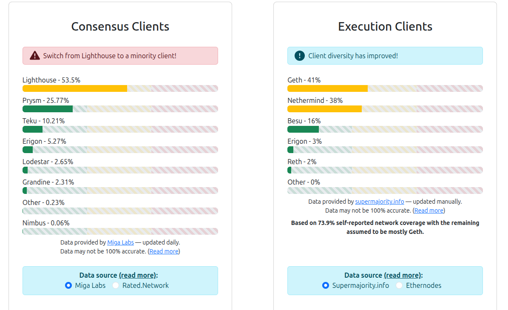

# Chapter 18: The Devil Is In The Details - A Reality Check

*🦩 Hi, I'm Flami! Welcome to the breaking ball. Time to get real.*

---

Remember Chapter 0? I warned you.

This book, until now, has been written with a **propagandistic tone.**

Not all statements you've read are 100% true. The devil is in the details.

The technical explanations—bits, algorithms, cryptography, consensus mechanisms—those are accurate. You can trust them, they are trustless.

But the **social implications**, the **promises**, the **revolutionary potential**? Those have been simplified, glossed over, and yes, sometimes exaggerated to keep you engaged.

**Why?**

Because revolutionary technologies are hard to introduce. If I started with "Bitcoin is slow, expensive, hard to use, environmentally costly, enables crime, can concentrate wealth, and most projects are scams," you would have stopped reading on page 3.

So I took the role of a "crypto" enthusiast—"cryptobro" some people call them. I distinguish "cryptobro" from "cryptotechbro": a cryptobro focuses on price speculation, knows nothing or very shallow details on the technology, and has never written nor read any actual source code. A cryptotechbro, on the other hand, understands the technology deeply and can read and write code, but still believes in the hype and propaganda around crypto without spending much time thinking about the social implications. Usually we are nerds, so why would you expect us to think about social interactions? Yeah, the author is one of them making the effort to think about social implications.

Anyway, I showed you the dream. The potential. The best-case scenarios.

**Now it's time for the reality check baby.**

This chapter will systematically address what I've oversimplified, what I've omitted, and where the propaganda diverges from reality.

**Buckle up. This is going to be uncomfortable.**

---

## Part 1: Is Bitcoin Actually "Money"?

### What I Told You

"Can we make bits mean 'money'? The answer is yes." (Chapter 9)

Bitcoin has the 8 properties of money: scarcity, verifiability, divisibility, etc.

### The Reality Check

**Bitcoin succeeds at some properties of money, struggles with others.**

Let's revisit those 8 properties with a balanced yin-yang perspective:

**1. Hard to control scarcity:** ✅ **Clear success.** 21 million cap enforced by code and social consensus.

**2. Verifiability:** ✅ **Clear success.** Anyone can verify transactions mathematically.

**3. No double-spending:** ✅ **Clear success.** Blockchain's core innovation prevents this.

**4. Transferability:** ⚠️ **Mixed reality.**
- ☯️ **Yin (challenges):** Eventually requires internet, electricity, and technical knowledge. Not as simple as handing someone cash. Geographic barriers remain (internet access, regulatory restrictions).
- ☯️ **Yang (potential):** Technical complexity is actively being reduced through Lightning Network, better wallets, and improved UX (user experience). This is not the hardest problem the industry has solved—it's solvable with time and engineering effort. Furthermore, Bitcoin is just one specific CDN; the benefits of the technology do not vanish because one specific implementation struggles. It would be like saying that if Toyota goes bankrupt, the whole automobile industry will collapse.

**5. Ownership:** ⚠️ **Conditional and complex.**
- ☯️ **Yin:** You own Bitcoin IF you control private keys, understand security, don't lose seed phrases, and don't fall for scams. Analysts estimate that roughly **10–20%** of all bitcoin may be permanently lost (recent analyses suggest between 2.3–4 million BTC lost). Even if you have gold in your home but your house is easily burgled, do you really "own" it?
- ☯️ **Yang:** True ownership without intermediaries is possible for those willing to learn. No bank or government can seize properly-secured Bitcoin. Effective self-sovereignty has a learning curve, but it's genuinely achievable—it is not even close to learning rocket science.

**6. Fungibility:** ⚠️ **Theoretical yes, practical challenges.**
- ☯️ **Yin:** Coins from hacks/crimes ("tainted coins") can trade at discounts. Address tracking links transaction histories. Some exchanges reject "dirty" Bitcoin. Privacy is harder than it seems.
- ☯️ **Yang:** Value is value. Even "black market" fiat money gets laundered into clean currency—ethical claims on money are as fragile as humans' ethics themselves. Tainted BTC will likely, as has always happened throughout history, eventually will likely return to licit transactions through modern forms of laundering.

**7. Divisibility:** ✅ **Clear success.** Down to satoshis (0.00000001 BTC)—far better divisibility than gold or cash.

**8. Durability:** ⚠️ **Context-dependent.**
- ☯️ **Yin:** Bitcoin requires active infrastructure (nodes, internet, electricity). In civilization collapse or internet failure, Bitcoin stops working. Gold is more durable in cataclysmic events. Bitcoin can't function offline like some programmable CDNs (Ethereum can temporarily work via signature exchanges even without internet—the "checks" analogy from earlier chapters).
- ☯️ **Yang:** In doomsday scenarios, will we really care about gold either? If peace returns, databases with BTC data could be restored and the network restarted. For 99.99% of realistic scenarios (not apocalypse), Bitcoin's digital durability (copies everywhere) is actually superior to physical assets (which can be destroyed, seized, or degraded).

**9. Extra: Portability** ✅ Physically moving gold is hard, or big piles of cash. However, any amount of bitcoin can be moved with you with a small paper or even nothing at all if you manage to remember 12 words in order inside your brain.

---

### **Additional properties Bitcoin DOESN'T fully have (yet):**

**9. Unit of Account:** ⚠️ **Mostly absent today, potentially changing.**
- ☯️ **Yin:** Almost no one prices goods in Bitcoin. Prices are set in fiat, converted to BTC at transaction time. This creates accounting complexity and volatility risk.
- ☯️ **Yang:** This is ultimately a choice. More people can slowly choose to display prices in BTC in their stores. El Salvador made BTC legal tender—showing it's possible. As volatility decreases with maturity, pricing in BTC becomes more viable.

**10. Medium of Exchange:** ⚠️ **Limited today, situationally useful.**
- ☯️ **Yin:** Very few merchants accept Bitcoin. Those who do often convert immediately to fiat. Volatility makes it terrible for daily transactions in stable economies.
- ☯️ **Yang:** In countries with hyperinflationary currencies (Venezuela, Argentina, Zimbabwe), Bitcoin is better than local money. Besides, even if not "cash," it can be used gold-like as a store and transfer of value. Even if it's not a realistic everyday money for most countries, it's still an economically useful asset.

**11. Store of Value:** ⚠️ **Volatile but improving.**
- ☯️ **Yin:** Bitcoin has had multiple 70-80% drawdowns. It's more like a speculative tech stock than "digital gold"—at least for now.
- ☯️ **Yang:** As markets mature, more people adopt, and liquidity increases, volatility tends to decrease (see: gold, equities, real estate over centuries). If adoption keeps growing, Bitcoin's volatility will likely continue declining. This is just how markets behave.

---

### **The Balanced Truth**

**☯️ Yin:** Today, Bitcoin is primarily used as a **speculative investment**, not as money. Most economists and central banks do not consider it money, at least they don't say it publicly, in the functional sense.

**☯️ Yang:** This is ultimately a matter of adoption and choice. If people agree on gold, they can also agree on Bitcoin—there is nothing fundamentally different about that mechanic. In fact, if we had a high liquidity Bitcoin market, its properties make it better and more comfortable to use than gold. Bitcoin is just one specific CDN implementation; CDNs (consensus-based database networks) are far deeper and more useful than just Bitcoin. As the saying goes: "Bitcoin is not crypto, and crypto is not Bitcoin." The technology has broader applications, and Bitcoin's current limitations don't define the entire field's potential.

---

## Part 2: The Centralization Problem

### What I Told You

"Everyone has a copy of the blockchain. No single person controls it." (Chapter 9)

Bitcoin is decentralized. No central authority.

### The Reality Check

**Bitcoin's power is concentrated in practice, but less so than traditional systems.**

---

### **Mining concentration:**

- ☯️ **Yin:** Recent pool statistics show the top 4 Bitcoin mining pools control **on the order of 60–70% of hashrate**, though this fluctuates (for example: Foundry ~32%, AntPool ~19%, F2Pool ~8%, SpiderPool ~6%). Top 10 pools control ~90%. If these pools colluded (or were coerced by governments), they could censor transactions, double-spend, or halt the network. This is a real centralization risk.

- ☯️ **Yang:** Any miner can leave an unfair pool and join another. In practice, switching costs, loyalty, and incentives keep miners concentrated—but the option exists. The path to further decentralization is clear: more pools and more miners. Running a full node costs approximately $500-800 in hardware plus electricity. If you have capital, you can become a miner or gather investors to create a new pool. A decentralized oligarchy of many small groups is structurally better than a dictatorship. And crucially: an oligarchy of miners is not the end of the story. What Bitcoin *is* gets ultimately decided by ALL nodes, even the cheap ones. A more decentralized mining landscape with more oligarchies strengthens the network against external attacks.

---

### **Geographic concentration:**

- ☯️ **Yin:** Most Bitcoin mining happens in a few regions with cheap electricity (historically China, now USA, Kazakhstan, Russia). Governments CAN attack Bitcoin by targeting these concentrated facilities. China's 2021 mining ban reduced global hashrate by ~50% temporarily—proving this centralization risk is real.

- ☯️ **Yang:** Major mining regions (USA, Russia, China, Kazakhstan) are geopolitically independent—often adversarial—actors. They don't trust each other by nature, which is precisely the problem CDNs came to address. The geographic distribution of mining across rival nations actually provides resilience: no single government can unilaterally shut down the network.

---

### **Wealth concentration:**

- ☯️ **Yin:** Top 2% of Bitcoin addresses hold ~95% of all Bitcoin. Early adopters and insiders became extraordinarily wealthy through information asymmetry. Bitcoin's wealth inequality (Gini coefficient) is WORSE than traditional financial systems. This creates economic power imbalances.

- ☯️ **Yang:** Nothing new under the sun. Early internet adopters also got extraordinarily rich (Google, Amazon, Microsoft, Meta/Facebook are now the world's most valuable companies). It's valid to criticize wealth concentration, but this doesn't uncover any "new evil"—it's human nature and timing. If your political system is easily corruptible by money, is that Bitcoin's fault? Should we deny technological improvement, or should we demand better institutional legitimacy to keep humanity moving forward? If we fix institutional corruption, wealth inequality becomes a manageable policy question, not an existential threat. Also worth noting: in Bitcoin, wealth does not equal power over the protocol. Mining hashrate and node operation determine network rules, not coin ownership. You can own zero BTC and still run a node that validates the rules.

---

### **Ethereum's staking concentration:**

Validators are the analogous to miners in the CDN of Ethereum. They do a thing called staking to prove their worth for writing to the database.

- ☯️ **Yin:** Post-merge, major staking providers (Lido, Coinbase, Kraken) control the majority of staked ETH. Lido historically peaked around **30–32%** of staked ETH and as of late 2025/early 2026 sits in the **mid-20s%** range (around **24–30%**). Validator sets are even more concentrated than Bitcoin mining. One entity controlling nearly a third is concerning. The iron law of oligarchies keeps appearing—can we actually create a CDN that is truly decentralized?

- ☯️ **Yang:** ETH is just another CDN, not Bitcoin—so again this doesn't condemn the entire field. To defend ETH specifically: Lido is a way to *aggregate* individual stakers' ETH—similar to mining pools but actually easier to leave. Individuals stake *through* Lido; they can withdraw and switch to other providers like Rocketpool. Developing staking software for Ethereum is relatively cheap, and moving funds around for this use case is absurdly cheap onchain. The Ethereum community actively advertises decentralization and warns when certain clients or staking platforms become too dominant—the community cares and responds. People who stake already demonstrate high knowledge and care—they're more likely to act responsibly. The ecosystem is self-correcting through social pressure and education.

In the image above we can see how a software that runs Ethereum, Lighthouse, is becoming too predominant and there are warnings to stop using it as much. As a curious fact, the author works for the very same compnay that develops the Lighthouse software.

Furthermore, regarding oligarchies, that is where the magic of CDNs comes in. As we said, with Bitcoin, an oligarchy of miners does not destroy the value of the network because ultimately the data is the final source of truth, and that is distributed across all nodes—which are far cheaper to run and actually very decentralized.

---

### **Development concentration:**

- ☯️ **Yin:** Small groups of core developers control protocol evolution. Bitcoin Core team and Ethereum Foundation wield enormous influence. Users technically can reject updates, but practically they follow developer recommendations. This creates "benevolent dictator" dynamics.

- ☯️ **Yang:** Users CAN reject updates—this isn't theoretical. Developers who care about the code can increase in number; it's open source. If people start caring more, more developers will join and write alternative implementations to decrease dependency. This concern is most valid while "crypto" isn't widely adopted. But if/when adoption grows, it will make sense for nations to use taxpayer money to pay excellent developers to write their own Bitcoin/Ethereum clients, minimizing dependency on any single team. If the community grows with awareness, this risk will be significantly mitigated. And crucially: this doesn't break CDNs right now. If something fails, battle-tested software that's been running for years is already available. Nodes can just quickly switch to an older version or other software. The system is resilient to any single team disappearing.

---

### **The Balanced Truth**

**"Everyone has a copy"** is technically true but misleading. **Power is NOT equally distributed.** Computational power and wealth do concentrate control over writing future data. But it does not grant extra influence on what the current data actually is, as that is stored by practically anyone.

The system is **way less centralized than a bank**, but **far from being at the ideal of all actions being fully decentralized.**

- ☯️ **Yin:** Bitcoin has real centralization risks that need ongoing attention and mitigation.
- ☯️ **Yang:** "Way less centralized than a bank" is a significant improvement—a good direction. The system has mechanisms for decentralization (forks, alternative clients, geographical distribution, permissionless participation) that traditional systems lack. Perfect decentralization may be impossible, but meaningful decentralization—enough to resist single-point-of-failure, completely arbitrary censorship—is achievable and actively maintained. These technologies have done nothing other than improve thanks to these traits.

---

## Part 3: The Bitcoin Energy Problem

### What I Told You

"Using energy as a scarce resource aligns incentives. Whether that trade-off is worth it is for society to decide." (Chapter 10)

### The Reality Check

#### Yin ☯️

**Bitcoin's energy consumption is massive and growing.**

**The scale:**
- Bitcoin uses more electricity than entire countries (comparable to Argentina, Netherlands)
- The Bitcoin network consumes on the order of **140–170 TWh per year** (recent estimates cluster around this range; ~150 TWh is a reasonable mid-range figure)
- Estimates for energy per **on-chain** Bitcoin transaction vary widely, but many put it in the **hundreds to over a thousand kWh** range (e.g., 700–1,400+ kWh depending on methodology)
- Carbon footprint depends on energy mix (often fossil fuels in regions with cheap power)

**The price-hashrate feedback loop:**
- "Bitcoin is valuable, so energy expenditure is justified"
- But Bitcoin is valuable largely due to speculation, not utility today
- Energy expenditure is proportional to **hashrate competition**, which increases when mining is profitable
- When Bitcoin price doubles, mining becomes more profitable, more miners join, hashrate increases, and energy consumption increases
- This happens even if transaction volume stays flat—the energy isn't serving more users, just securing higher speculative value

**The environmental externalities:**
- E-waste from obsolete mining hardware (ASICs become obsolete every 1-2 years)
- Mining concentrates in regions with lax environmental regulations
- Fossil fuel use is common (cheap energy often means coal or natural gas)
- These costs are externalized (society pays through environmental damage, miners profit)

**The comparison problem:**
- "Banks use energy too!" — True, but banks serve billions of users daily with diverse services. Bitcoin primarily serves millions of speculators.
- "Gold mining uses energy!" — Gold has industrial uses (electronics, dentistry) and aesthetic/cultural value spanning millennia. Bitcoin's primary use today is speculation.
- These comparisons are whataboutism, not justification for the energy expenditure.

**"Society decides"** is misleading. Society doesn't meaningfully decide Bitcoin's energy use—it's determined by miners maximizing profit within competitive dynamics. There's no democratic process, no vote, no collective decision-making mechanism.

**Proof-of-Stake addresses this** (Ethereum uses 99.95% less energy), but introduces different security and centralization tradeoffs.

---

#### Yang ☯️

**Energy sources are a general humanity problem, not Bitcoin-specific.**

The main issue—carbon-emitting energy sources—is a civilization-wide challenge affecting all industries. Bitcoin doesn't create this problem; it inherits the existing energy infrastructure. As renewable energy becomes cheaper (which it is—solar and wind are now the cheapest electricity sources in most regions), miners naturally migrate to these sources for profit maximization. Blaming only Bitcoin for this ignores the actual problem: our global energy mix.

**E-waste is a broader technological challenge too:**

Hardware obsolescence isn't unique to Bitcoin. Old ASICs can be repurposed for other compute tasks: personal computers, gaming PCs, training local AI models. Yes, this is a concern—but it's part of the larger e-waste problem. How many Apple phones are thrown away each year? How many new iPhone versions launch with questionable improvements? E-waste is a real concern across all technology, not just Bitcoin. We should address it systematically, not mention just one technology.

**Against the speculation criticism:**

Yes, Bitcoin is primarily speculative today—but the reader should understand by now that **this is a choice**. You can help change it. If you're a speculator, you can shift your framing: "I'm going to hold Bitcoin because I agree it has value for coordination, not just profit." Everyone's voice matters. Value is social consensus, and you're part of that consensus. Be one more voice pushing for real gold-like utility, not just speculation.

**Cost-benefit analysis is context-dependent:**

You might say, regarding the CO2 emissions and other monetary costs... okay, planes pollute, but at least they are blatantly useful.

Are Bitcoin's costs worth the benefit? We'll only see when people use it at its fullest potential—as a new and better form of digital gold, as a neutral settlement layer for international agreements. Programmable international coordination can bring enormous value. We can even say, without exaggeration, that better coordination mechanisms can save lives (preventing conflicts through economic interdependence). Is every human life saved worth the cost of running CDNs?

The problem with assessing the cost-benefit of CDNs like Bitcoin is that we would be trying to measure the value of generating a revolution in how we trust—and that is unmeasurable because the way people, entities, and nations talk to each other would fundamentally change. The potential is clearly enormous and hard to quantify. Just like with the current developments in Artificial Intelligence.

**This debate is eternal and normal:**

The benefits of certain CDNs like Bitcoin relative to their costs is a true, ongoing debate. Just be fully aware of both sides. This debate will never end—it's inherently human: "Should we keep using tool X? Should we switch to tool Y?" Ultimately, this is classic human coordination, nothing special to Bitcoin. It happens with all products. Trade-offs are evaluated, society chooses, society tries the new technology, and if the choice brings an overall benefit, it gets adopted.

The main issue with CDNs like Bitcoin is that the benefits are pretty much impossible to measure quickly. We would need to use the technology for one or two generations and see if the programmable economic dependency correlated with a decrease of war threats or even wars themselves and a betterment in quality of lives globally.

---

## Part 4: The Exaggerations

### **"Prove ownership of digital assets without central registry":**

**Yin ☯️:** You can't really separate ownership from the physical world.

At the end of the day, if your house is your house, it's because if someone steals it from you—like enters to live there and says it's theirs—the only thing that will make you regain ownership is showing the police that in the State's database or records it says it's yours.

Cryptographic ownership does not exist legally as of now. Most people use custodial services (Coinbase, etc.), reintroducing intermediaries. Legal recognition remains unclear—courts may not enforce cryptographic ownership without legal identity.

**Yang ☯️:** As adoption grows, parliaments will be pressured to create legal frameworks recognizing cryptographic ownership. What we have now are better, untamperable records—you can see what's happening with your property and detect immediately if something sketchy happens to the ownership records. That's the real innovation.

**Bottom line:** CDNs don't come here to guarantee physical ownership. They come to provide transparent, untamperable records that can support ownership systems.

---

### **"Coordinate without trusted intermediaries":**

**Yin ☯️:** The claim of no intermediaries is false. You're still trusting the nodes.

**Yang ☯️:** The nodes are so many and so well designed that trust is practically guaranteed through decentralization. This is where the new word "trustless" comes from—not that you trust nothing, but that you trust a system designed so no single party has a rational incentive to ever betray you. The only real threat is external groups trying to break the system from outside or infiltrate spies to break it from within.

---

### **"Physically impossible things are now possible":**

**Yin ☯️:** "Physically impossible" is an exaggeration.

**Yang ☯️:** No new physics were invented—only clever uses of math and computers (new engineering feats). So more accurately: **technically impossible** before the breakthrough. But if no one knew how to build it, even though the materials existed, it was **practically impossible** to have it—which, for all intents and purposes, made it feel "physically impossible."

---

## Part 5: Smart Contracts Aren't That Smart Nor Unstoppable

### What I Told You

"Smart contracts are unstoppable. No one can change the rules once deployed. Code executes automatically." (Chapter 13)

### The Reality Check

**Admin keys and upgrade mechanisms:**

- ☯️ **Yin:** Some deployed contracts include "owner" addresses with special privileges. Common admin powers: pause contract, upgrade logic, mint tokens, adjust parameters. Many DeFi (Decentralized Finance) "hacks" involve compromised admin keys or malicious developers using their privileges. "Unstoppable by default" should be "stoppable by default, with rare exceptions.

- ☯️ **Yang:** Anyone can create the very same version of code but without an owner. Users are completely free to interact with whichever code they see fit. And, by default, smart contracts do not have an owner. It is something a human has to code explicitly.

---

**Oracle dependencies:**

- ☯️ **Yin:** Smart contracts need external data (prices, weather, sports scores). Oracles are centralized points of failure. If an oracle is manipulated, the contract executes incorrectly despite code being "correctly programed." Trusting oracles reintroduces trust assumptions.

- ☯️ **Yang:** Innovation is ongoing—CDNs completely specialized in providing data (Chainlink is an example) are being developed. Designing trust-minimized oracles with CDNs and game theory alignment is an active area of research and development, already being used to safely handle millions of dollars of value.

---

**Gas costs:**

- ☯️ **Yin:** Deploying contracts costs hundreds to thousands of dollars when Ethereum is congested. "Anyone can deploy" is technically true, practically false for most people. Interacting with contracts also costs gas—complex DeFi operations can cost $50-200 in fees.

- ☯️ **Yang:** Layer 2 dramatically reduces costs. Open source software to ease interaction is emerging, along with tutorials across the internet. It's true that not anyone right now is able to deploy their own bank with no computer science knowledge and 1 click—but that's doable. We just need 2 or 3 nerds to code it as a summer project. And that's not unrealistic nerd behavior at all. Furthermore, L1s are also becoming more and more cheap to use as time goes and technological improvements are created.

---

**Code transparency ≠ user understanding:**

- ☯️ **Yin:** "Transparent and auditable" assumes users can read Solidity code. 99.9% of users cannot audit smart contracts. Even audited contracts get exploited (see: dozens of audited DeFi hacks). Transparency benefits sophisticated attackers more than average users.

- ☯️ **Yang:** The security industry is very profitable and needed, therefore growing. The oligarchy of code verifiers is growing and becoming more decentralized. Ways to seamlessly pay insurance in case of a hack are being developed. The ecosystem is maturing and smart contracts are growing more secure every year. Security is still a big concern that should not be ignored, but the trend is clear and positive.

---

**The reality:** Smart contracts are powerful, but they're not magic. They're code running on distributed systems which, even if the system they run on is trustless, the contracts can have code programmed on them with trust assumptions, centralization points, and different social governance.

They are still not secure enough for most people to blindly trust with large amounts of money without due diligence. Yet, this trend is improving over time and it is not that big of a challenge to overcome. As you can see, there are job opportunities everywhere for hackers willing to help secure the smart contract and CDN ecosystem of the future. The author is one of those hackers who is day by day helping secure this ecosystem.

---

## Part 6: Layer 2s Don't Solve Everything

### What I Told You

"Layer 2s enable fast, cheap transactions while Layer 1 provides security. The best of both worlds." (Chapter 15)

### The Reality Check

**Security is NOT Layer 1 security:**

- ☯️ **Yin:** There are lots of technical designs for L2s, each with their own set of challenges, trade-offs, and complexities. Some might not be examined as thoroughly by security researchers (hackers who protect code instead of abusing it), and therefore they might have vulnerabilities not yet discovered. The ecosystem is still young and maturing.

- ☯️ **Yang:** All systems start young and fragile. L2s are even younger than Bitcoin. This is a very ambitious system, therefore it will take time to mature. But the trend is clear: more people are working on it, more money is being invested, more knowledge is being accumulated. The ecosystem is maturing.

---

**L1 checkpoints don't guarantee complete safety:**

- ☯️ **Yin:** If L2 operators don't post updates to L1, there's no "checkpoint." L1 can't fully validate L2 logic—it just stores summaries. If L2 operators collude and post false information, L1 won't detect it unless fraud detection mechanisms work. Many L2s have centralized controllers that can block transactions before they reach L1.

- ☯️ **Yang:** L2s are improving their security models and becoming more decentralized, putting effort into avoiding single points of failure. For example, the decision of posting data to L1 to create a checkpoint doesn't rely only on one entity. L2Beat is a website where criticism is made of every Layer 2 to warn about their centralization points. The whole ecosystem is aware of this and applies constant pressure and criticism to these L2s to improve. Furthermore, novel engineering techniques are being developed to avoid these kinds of risks. Overall, the ecosystem is maturing and Layer 2s are slowly becoming more trustless.

---

**The UX (User Experience) complexity:**

- ☯️ **Yin:** Users must understand technical concepts, manage multiple wallets, trust bridge contracts (many hacked for hundreds of millions), and pay multiple transaction fees. "Give us time and we'll simplify it" has been the mantra for years with limited progress. The complexity isn't just UI (User Interface) polish—it's systemic (multiple trust models, different security guarantees, fragmented liquidity).

- ☯️ **Yang:** Even though "we will simplify it" has been going on without completion, it's because there are harder problems to prioritize. Solving UI/UX problems is not the hardest problem this industry faces right now. Current efforts are proposing standards that make it easier at a technical level to interact with multiple databases (chains), and their creation will lead to UX simplification too. Furthermore, it's just a matter of time and more people working to fix the UX problems. The industry is actually young and small.

---

**Network effects fragment:**

- ☯️ **Yin:** Liquidity splits across L2s (your money on one L2, your friend's on another = hard to transact). Developer attention fragments (build on which L2?). User confusion (which L2 should I use?). The "societies within societies" framing is pretty, but it's coordination chaos in practice.

- ☯️ **Yang:** Ways to create code that works across any chain ("write once, use anywhere") are being developed. User confusion will disappear when UX improves—they'll just see their money, their value, and different investment options. Advanced users will be able to click details to see which database they're in and its risks. But for now, that's not the case. Again, yes, now it's chaos and messy, but the ecosystem is maturing and these problems are being addressed.

---

**Linux comparison and adoption:**

- ☯️ **Yin:** I said "Linux works perfectly and anyone can use it." Reality: Linux desktop share is still a **small single-digit percentage**, but has recently climbed to around **4–5%** globally (as of 2025, up from <3% in previous years). Linux succeeds in servers (managed by professionals) but still struggles in consumer adoption. Using Linux as proof that "anyone can use complex open-source software" contradicts decades of evidence. **"Give us time and we'll give you collective freedom"** is hopium. After 15+ years, the problems haven't decreased—they've increased.

- ☯️ **Yang:** People CAN learn to use Linux if they put in a few afternoons of effort—5 days at most. It's not that complex, but people's attention is a scarce resource. We must make efforts to get people to care about this, or make it so simple that people don't need to care about it. Both paths are being worked on. If you invest 5 days of your life learning a new tool that can grant you more power and freedom, over time you might even recover them because of the more efficient society you live in—you might get 6 days of holidays down the line. Sure, it's a big effort and must be done by lots of people, so until everyone does it, the benefit likely won't be seen by most people. Things that are worth it require effort: learn and teach, or make it even easier for others to learn. The "laziness" and ignorance of the masses about what they should prioritize learning in their lives is a problem—but it can be overcomed. People wait to cross streets when there's a crosswalk; people learned to use smartphones—which might feel easy now but isn't. It's a massive change we made (see an old person trying to learn it). This one isn't that massive; we just need teachers, and preachers even, but mainly friendly teachers. Selfless teachers if possible.

---

## Part 7: The No Trust Myth

### What I Told You

"You don't need to trust anyone. Math doesn't lie. Coordination through math, cryptography, and incentives." (Chapter 17)

### The Reality Check

**"Trustless", even if novel and necessary, is still a bit of a misleading term. You still trust many things.**

What you're trusting:

**1. Cryptographic assumptions:**

- ☯️ **Yin:** Assume elliptic curves aren't broken (quantum computers might break them). Assume hash functions are secure (SHA-256 collision resistance). Assume no mathematical breakthroughs break current crypto.

- ☯️ **Yang:** To be fair, the whole world works under this assumption. Current banking, military systems, your phone—all modern cryptography relies on these assumptions. Therefore, it's not a new problem unique to CDNs or even to humanity. Yes, if a brilliant mathmatician figures our a way to break this tomorrow the world might become chaos, sorry for revealing you this assumption under which we all live with.

---

**2. Code implementations:**

- ☯️ **Yin:** Trust developers wrote error-free code (they don't—smart contract hacks exist). Trust no backdoors were introduced (can you audit millions of lines of code?)

- ☯️ **Yang:** Error-free code, not only in CDNs but in general, is impossible—that is true. But specialists work every day to make sure the bugs are small and not impactful. Join them if you please, but it is very difficult to master. The code is getting more and more secure. Everyone uses and will use this software, so it will be in the interest of all nations to get it right and make sure no other nations put weird code that can be used against them. Therefore, there is a massive incentive to get it right. AAVE, a "bank on the blockchain," is handling already billions of dollars in value from people all over the world. The idea of code containing bugs and backdoors is a valid concern, yet it is extremely complex to actually exploit. Only people with lots of time and lots of knowledge can do it, like geniuses financed by nation-states. Spying software in everyday code used in devices is a thing because the code is private and controlled by corporations which might be bribed or just fooled. But this time, the code is public infrastructure, therefore all nation-states that are against each other will make sure no one introduces "hacks." Sure they will try, but others will be watching and notifying. Now it is just a "few billion" dollars on the line, but in the future, if the majority of the world's finance moves to CDNs, the incentive to get it right will be enormous for anyone.

---

**3. Economic incentives:**

- ☯️ **Yin:** Trust that miners/validators remain economically rational. Trust that 51% of hashpower stays honest in the case of Bitcoin. Trust that incentives continue aligning—what if economics change?

- ☯️ **Yang:** Current CDNs are clearly showing that the consensus algorithms are well designed. It can happen that a newly created one does not get it right, true, but knowledge on how to do it is already established. Only external actors can take down these systems, whether from external attacks or infiltrating from within. The economic incentives are well designed and they are proven to work. The real worry you should have is external attackers and the new incentive designs in new CDNs who have been running for not that much time.

---

**4. Social consensus:**

- ☯️ **Yin:** Trust that community won't hard fork against your interests. Trust that developers won't introduce changes you dislike. Trust that users won't abandon the network (causing collapse in value).

- ☯️ **Yang:** This is an inherent human nature problem, not really specific to CDNs. Every day you wake up you trust the internet will work, that no one will do a coup d'etat in your country, that the parliament won't pass a law that prejudices you. These are problems arising from social coordination and consensus—very old problems with very old dynamics. If these things happen, you either change networks or adapt. Sure, be aware of newly created CDNs that are especially centralized; the risk is real, the same way you have to be careful if a State is a dictatorship and one day the dictator decides to act against you. The best thing to do to assure peace of mind is to see which CDNs have the most reliable track record of not altering their consensus frequently or quickly or arbitrarily.

---

**5. Infrastructure:**

- ☯️ **Yin:** Trust that internet remains available. Trust that electricity grid works. Trust that nodes continue running. Trust that exchanges/wallets provide access.

- ☯️ **Yang:** Again, the whole world relies on this today. Regarding nodes, it is like saying trust that your router device at home will work. If a CDN has few nodes, it has more chances of being taken down accidentally or maliciously—so take that into account. For now, big CDNs almost never experience this. Ethereum has had **near-perfect uptime** since 2015, with no major chain-wide outages (celebrating 10+ years with effectively no network-wide downtime). Bitcoin has achieved **~99.99% uptime** since 2009, with only two significant incidents early in its history. That mimics current internet technologies' uptime. Centralized exchanges only make sense in the world of today, but in the future when everyone is onchain they will stop making sense. DEXes (decentralized exchanges) already exist and you don't need permission from anyone to use them. Furthermore, lots of wallet software exists, even open source, and even more is being created. The likelihood of you not being able to access your money because of a wallet problem is ridiculously low. JUST REMEMBER: NOT YOUR KEYS, NOT YOUR COINS. A wallet stops working? You use another one, activate your keys, and move the coins.

---

**6. Oracles and bridges:**

- ☯️ **Yin:** Most of this new decentralized finance (DeFi) relies on price oracles (Chainlink, etc.)—centralized trust points. Cross-chain bridges require trusting bridge contracts (many hacked).

- ☯️ **Yang:** As said before, lots of innovations are being made to make oracles and bridges more trustless. The ecosystem is maturing and these problems are being addressed. Chainlink has been working for years now providing reliable and accurate prices and more world data to these networks, and there are more oracles. The systems do work in a trust-minimized way. If you are curious, they also usually run local CDNs with their classic economic incentives guaranteed by game theory and cryptography to make sure no one from within cheats.

---

**Conclusion:**

**Indeed the accurate term is "trust-minimized"** (reducing trust requirements), not "trustless" (which seems to imply eliminating trust completely). But to be honest, all human interaction is eventually based on trust. Trustless is impossible for human nature. The idea of designing technological systems that systemically reduce trust-needing factors is still new and should have a word. You choose it to be honest—the industry is new and the term that will stay is the one people eventually use.

I prefer trust-minimized. Which one do you?

---

## Part 8: The Use Case Problem

### The Elephant in the Room

After 15+ years, **crypto's primary use case is speculation**, not the revolutionary applications promised.

**What people actually use crypto for:**

**1. Speculation/Investment (90%+ of volume):**
- Buying/holding Bitcoin hoping price goes up, not using it as money
- Trading fancy volatile coins (like the so-called Meme coins) to make quick profit and leave

**2. Illicit activity (significant but declining %):**
- Ransomware payments
- Dark web markets
- Money laundering
- Tax evasion
- Sanctions evasion
- Ponzi schemes that are clear scams

**3. Actual utility (~1%):**
- International remittances (some use, but fees + volatility limit adoption)
- Censorship resistance (activists in authoritarian regimes—real but tiny volume)
- Unbanked financial access (mostly aspirational, limited real-world success)

**What crypto is NOT widely used for:**
- Directly buying goods/services (virtually zero merchant adoption)
- Paying employees (rare, mostly crypto companies)
- Storing savings (too volatile or risky due to hacks)
- Traditional banking functions (lending, mortgages, etc.)

**The gap between promise and reality is enormous.**

The book presented use cases as if they're current reality. Most are aspirational at best, fantasy at worst.

---

☯️ **Yin:** After 15+ years, the primary use remains speculation. The revolutionary applications haven't materialized at scale. Most promises remain aspirational. Illicit activities represent significant usage, which raises serious concerns about enabling crime.

---

☯️ **Yang:** The change this technology brings is deep—redefining trust architecture is a colossal civilizational change involving everyone from citizens, to developers, to governments. This will take generations, not just a few years.

**On illicit activities:** Every transformative technology gets weaponized initially. Guns, the internet, encryption—all enabled more sophisticated ways of doing crime. The deep web facilitates illegal markets, yet we didn't abandon the internet. We learned to manage risks while capturing benefits. Most people use the internet legally today. CDNs will follow the same pattern: society will develop frameworks to mitigate abuse while preserving the advantages.

**On timeline expectations:** Changing institutions, habits, and collective understanding requires time and collective effort. If you expect the classic developer mindset of "move fast, break things" progress, you'll be frustrated. Trust-minimization technology demands careful development, education, marketing, and social consensus-building across all of society—from the most democratic to the most authoritarian nations.

**On the speculation-to-utility transition:** The current speculative activity, while not the end goal, is funding infrastructure development. Early internet companies were also built on speculative investment before proving utility. The difference between speculation funding development and speculation as the only purpose is that development is actually happening: Layer 2s are being built, wallet UX is improving, regulatory frameworks are emerging. Whether this development leads to mainstream utility in 5, 10, or 30 years remains uncertain—but the work continues.

Be patient, resist gambling temptation, spread knowledge, and help build this technology. Yes, it's difficult to not sound like a sect when building revolutionary technology—I'm sorry. You can do more than this, more in the following section.

---

## Part 9: The Ideology Problem

### What I Told You

"Bitcoin doesn't have a political opinion. It's neutral technology. Humans give it meaning." (Chapter 17)

### The Reality Check

☯️ **Yin:** I told you this for the sake of simplicity, marketing, and reader engagement. But it's misleading. CDNs are built on social consensus, therefore they embed the ideologies of their communities.

The technology layer itself may be neutral, but **how we apply it and what values we encode into it are not.**

**Bitcoin is deeply ideological.** Bitcoin is NOT neutral—it's opinionated technology, sustained by a community which values specific principles like limited supply, censorship resistance, and anti-inflationary policy.

---

☯️ **Yang:** Yet this doesn't mean the technology is inherently evil or broken. All human institutions embed values—that's unavoidable. What matters is:
1. **Transparency**: Bitcoin's values are explicit and visible in its code
2. **Choice**: You can fork it or create alternatives with different values
3. **Participation**: Anyone can join the conversation about what those values should be

Traditional financial systems also embed ideologies: Keynesian economics, central bank control, surveillance... And you can not escape them as easily at all.

---

## Part 10: So What Should You Do?

You should have enough knowledge to think on your own by now, but here's practical advice:

**1. Only risk what you can afford to lose.**
- Crypto is highly speculative and volatile today
- Don't use crypto for savings—use stable, boring traditional instruments instead
- Treat it like lottery tickets or casino chips, without gambling

**2. NEVER share seed phrases.**
- If someone asks for your seed phrase, they're scamming you. Even if it literally is the real CEO of a reputable company.
- Not your keys, not your coins.

**3. If you experiment, stick to established CDNs.**
- Bitcoin or Ethereum are least scammy (still risky)
- Avoid altcoins, meme coins, new tokens (99.99% of them are scams whether their creators know it or not)

**4. Be deeply skeptical.**
- Most crypto projects are scams, rug pulls, or Ponzis
- "Too good to be true" yields? 986% APY on my crypto-dollars? It might disappear tomorrow
- Celebrity endorsements? Usually paid promotions in which the celebrity, or their family to make it more discreet, get a portion on a zero-sum game algorithm moving the price
- If you don't understand the technology, don't invest
- Complexity and weird wording, or overwording something, often hides scams

**5. Use traditional finance for most things now.**
- Banks, credit cards, regulated brokers have problems but also protections
- They work better for most people, most of the time
- If you are uneducated or cannot self-control, protection is a good thing actually. Good news is that those two traits can be improved with time and effort

**6. Yet, slowly adopt and experiment carefully.**
- Accept stablecoin payments in your shop if you own one
- Use decentralized banks to earn yield on cash you don't need immediately
- VISA/Mastercard already allow indirect crypto spending even if merchants don't accept it
- Pay friends for dinners via wallets to get comfortable using them
- Keep main net worth out of crypto, but do put some in it to learn. Remember, money you really do not need.
- The technology depends on adoption; you're building a more efficient future
- Share knowledge with friends—educate without being annoying
- Slowly learn to improve the way you store your keys: instead of paper use titanium plates, or encrypt them in multiple USBs, buy a hardware wallet...
- Learn to run a node of your favorite CDN and make it even more secure via decentralization.

**7. If you believe in the tech, contribute meaningfully.**
- Don't just speculate or experiment with spare change
- Build, educate, invest in or contribute to the ecosystem
- Care about the real potential for humanity

**8. Stay humble and keep learning.**
- No one knows the future
- We may not see massive adoption in our generation
- "Number go up forever" isn't a smart investment thesis
- Read skeptics AND believers
- Form your own conclusions

---

## Wrapping Up The Breaking Ball

**CDNs are:**
- Real technology ✅
- Novel capabilities ✅
- Overpromising and underdelivering (like all marketers need at some point) ✅
- Unsolved problems (like all technologies) ✅
- Mostly speculative usage today (you, literally you, can change that) ✅
- Crime enablement (like all tools) ✅
- Complex to use currently (like all technologies at first) ✅
- Uncertain future (like with any innovation) ✅

---

### I like trains.

When trains were invented in the 1800s, imagine telling people: "Trains are slow now, but if we keep investing, they'll bring you from Tokyo to Osaka in 3 hours instead of 10! We must keep building this 'train' technology—it's clearly the future of transportation."

Some people would have, understandably, called you crazy or a scammer.

Yet, fast forward through innovations in multiple fields, and today we have high-speed trains that do exactly that.

**CDNs are in a similar early phase—the first trains of a trust management revolution.** But unlike the 200-year journey from steam engines to bullet trains, we have advantages: global internet coordination, AI-powered information processing, and accumulated engineering knowledge. Huge leaps in innovation can now take just 20 years, maybe less.

---

### The Balanced Truth

**For most people, most of the time, traditional systems work better right now.**

**But for some people in some situations—activists under authoritarian regimes, people in hyperinflationary economies, those building permissionless applications—crypto is genuinely valuable today.**

**More importantly:** The technology is real. The capabilities are novel. The potential remains enormous. Whether that potential gets realized depends on us—builders, educators, critics, and adopters—choosing to work toward the better future while acknowledging and fixing the present problems.

---

**This book showed you the dream. This chapter showed you the reality.**

**Now you can decide for yourself.**

You've seen both sides: the revolutionary potential and the harsh limitations. You understand the technology deeply enough to make informed choices. You know the risks and the possibilities.

**What you do next is up to you.**

Will you build? Will you educate? Will you experiment carefully? Will you wait and watch? Will you critique constructively?

Just do it with clear eyes.

Welcome to the other side of the breaking ball.

**🦩 — Yours Faithfully, Flami, the realistic flamingo.**

---

**Next:** The book is almost done, let's start the conclusion. Chapter 19 will recap the entire journey—from bits to Bitcoin, from cryptography to coordination. You'll see what you've learned and what you can build with that knowledge.
